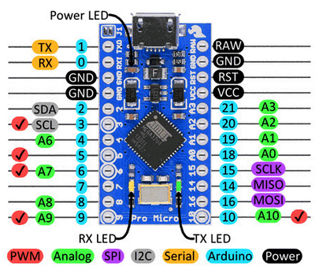
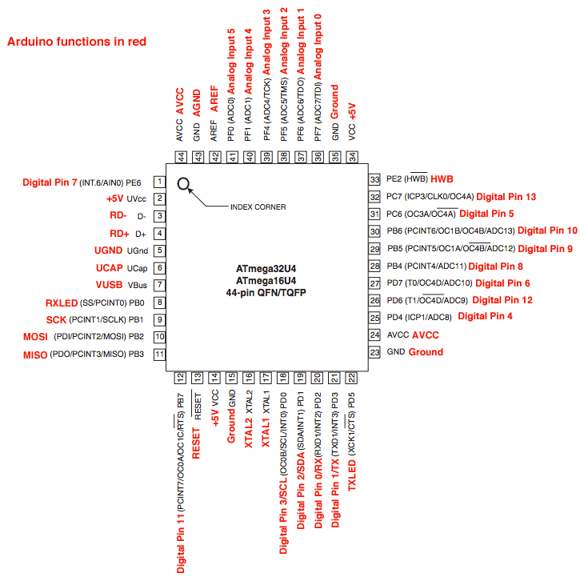

# Usar Eclipse Sin AVR Plugin, con AVR toolchain actual, AVR Dude Actual, con make actual, extra sin Eclipse.

# Requisitos:
## Webs:
- AVR Toolchain: [De Microchips](https://www.microchip.com/en-us/tools-resources/develop/microchip-studio/gcc-compilers)
- AVR Dude: [GitHub Zip usado: avrdude-v8.0-windows-mingw-x64](https://github.com/avrdudes/avrdude/releases)
- MSYS2: [Bajar .exe y seguir las instrucciones de la web](https://www.msys2.org/)
- Eclipse C/C++: [Elegir Eclipse IDE for C/C++ Developers](https://www.eclipse.org/downloads/packages/)

## Variables de entorno.

- Menu ``Window -> Preferences -> C/C++ -> Build -> Environment``.
- Boton Add..
  - Name: ``PATH``
  - Value: ``C:\avr-toolchain\bin;C:\avrdude\;C:\msys64\usr\bin``

Obviamente, descomprimiste AVR Toolchain y la renombras a avr-toolchain y la pegas en C. Lo mismo para avrdude, en el casi de msys64 es donde por defecto te pide instalarse, en usr/bin esta make.exe. Agregarlos también a la variable de entorno en Windows, incluir también eclipse, que también es solo descomprimir, mover a C:/eclipse y hacer un shorcut en el escritorio.

Botones Apply y Apply & Close según corresponda.


# Crear Menu para flashear:

- Ir a Menu ``Run-> External Tools -> External Tools Configuration``. Clic en ``Program`` solo para seleccionar, luego Primer icono, ``New configuration``(Justo arriba de la palabra Program).

  - Name: ``Flash con AVR Dude`` o Flash como quieras
  - En pestaña Main:
  - Location: ``C:\avrdude\avrdude.exe`` usando el botón ``Browse File System...``
  - Working Directory: ``${workspace_loc:${project_name}}``

  - Esto es para automatizaar, sin importar cual es tu workspace o el nombre de tu  proyecto, va a funcionar, obvio si tu proyecto lo pones en la carpeta de workspace que le indicaste a eclipse en el primer lanzamiento. Por defecto, tu ``usuario/eclipse_workspace/tuProyecto``.

  - Arguments: 

    ````
    -p m32u4 -c avr109 -P COM${COM_PORT}  -b 57600 -D -U flash:w:${project_name}.hex:i
    ````

Pero borra ``${COM_PORT}`` y colocate justo después de la palabra COM, Presiona el Botón ``Variables``, luego ``Edit Variables``, en la ventana presiona ``New``:

- Name: ``COM_PORT``
- Value: ``10``
- Description: ``Serial Port``
- Apply & Close

Selecciona en la ventana Select Variable ``COM_PORT`` que ahora estará y dale a OK, esto dejara la lineal de comando tal cual la presentamos arriba. Dale a Ok.


# Hacer Templates para Makefile y C:

- Menu ``Window -> Preferences -> C/C++ -> Code Style -> Code Templates -> Files -> Text``, Botón ``New``, poner lo siguiente:
  - Name: ``makefile`` Type: ``Makefile``
  - Description: ``Makefile template para ATmega32U4``
  - Pattern:

  ````
  # Makefile para ATmega32U4 (Sparkfun Pro Micro)
  
  MCU = atmega32u4
  F_CPU = 16000000UL
  BAUD = 57600
  PORT = $${COM_PORT}        # Usa la variable de entorno COM_PORT
  
  CC = avr-gcc
  OBJCOPY = avr-objcopy
  AVRDUDE = avrdude
  
  CFLAGS = -Wall -Os -mmcu=$${MCU} -DF_CPU=$${F_CPU}
  LDFLAGS = -mmcu=$${MCU}
  
  # Detecta automáticamente el nombre del proyecto según el nombre de la carpeta actual
  ROOT := $$(dir $$(abspath $$(lastword $$(MAKEFILE_LIST))))
  TARGET := $$(notdir $$(patsubst %/,%,$${ROOT}))
  
  SRC = $${ROOT}$${TARGET}.c
  OBJ = $${ROOT}$${TARGET}.o
  
  all: $${ROOT}$${TARGET}.hex
  
  $${ROOT}$${TARGET}.elf: $${OBJ}
  	$${CC} $${CFLAGS} -o $$@ $$^
  
  $${OBJ}: $${SRC}
  	$${CC} $${CFLAGS} -c $$< -o $$@
  
  $${ROOT}$${TARGET}.hex: $${ROOT}$${TARGET}.elf
  	$${OBJCOPY} -O ihex -R .eeprom $$< $$@
  
  flash: $${ROOT}$${TARGET}.hex
  	$${AVRDUDE} -v -p $${MCU} -c avr109 -P $${PORT} -b $${BAUD} -D -U flash:w:$${ROOT}$${TARGET}.hex:i
  
  clean:
  	del /Q *.elf *.hex *.o 2>nul || rm -f *.elf *.hex *.o
  ````

Luego presionar los botones:
- Apply, Apply & Close.


Regresar al mismo menu pero elegir `C Source File -> Default C source template`, presionar Edit.

- Description: dejar así.
- Pattern:
    ````
    #include <avr/io.h>
    // Aquí puedes agregar cualquier otra librería que necesites
    
    int main(void) {
        // Configuración del microcontrolador (pines, interrupciones, etc.)
    
        while (1) {
            // Lógica principal del programa
        }
    
        return 0;
    }
    ````
Ok. aca pueden agregar más includes, esto es lo mínimo que cualquier programa tendrá.


# Como empezar, tras todo eso?.

Cerras y abris Eclipse.
- Le das a ``Create a new C or C++ project`` o a ``Create project`` es indistinto te llevan al mismo menu.

- En la ventana elegi ``Make -> Make File Project -> Next``:
  - Project name: ``loqueseteocurra``, presionas Finish.

- File -> New -> Source File
  - Source file:``loqueseteocurra.c``

Es decir debe tener el mismo nombre que tu proyecto/SourceFolder, ya que la automatización que metimos te ayuda en eso. Sino deberías configurar cada proyecto de forma diferente.

- Template: Como esta!, Para eso la modificamos!.

## Ahora el Makefile:

- File -> New -> File from Template
 - File name: ``Makefile``

Automáticamente el campo de texto en Use template cambiara a ``makefile``, presionas ``Finish``. ese archivo esta automatizado, no hace falta tocarlo, si no requerís agregar ``CFLAGS`` o ``LDFLAGS`` u otra cosa que mi ignorancia no sepa.


El martillo construye, para construir y subir, enchufar el Atmega32U4, clic en el archivo ``.c``, en el menu superior vas a ver un menu desplegable con un icono con una C y el nombre del archivo. Desplegas y elegís ``Flash con AVR Dude`` o lo que le hayas puesto al hacer el paso de ``Program External Tools``.

Ahora, con un botón conectado a RST y GND del Sparkfun ProMicro(ATmega32U4 16Mhz) lo presionas y acto seguido, pulsas el botón play al lado del martillo, el que tiene algo con rojo supongo una caja de herramientas, ese es el botón de Build&Flash con AVR Dude.

# Si no ves algo asi:
  ````
  Reading 202 bytes for flash from input file trending.hex
  Writing 202 bytes to flash
  Writing | ################################################## | 100% 0.02s
  Reading | ################################################## | 100% 0.00s
  202 bytes of flash verified
  
  Avrdude done.  Thank you.
  ````
La placa no entro en modo bootloader, reintentar.


# MODO ÑOÑO: Bloc de Notas y Terminal.

- Clic Nueva Carpeta
Le pones el nombre del `archivo.c`, no importa donde lo hagas. Entras y abris la Terminal desde ahi Clic derecho Abrir Terminal.
  
  ````
  notepad Makefile
  ````
Pulsas Si

## Pegas el contenido:

  ````
  # Makefile para ATmega32u4 (Sparkfun Pro Micro)
  
  MCU = atmega32u4
  F_CPU = 16000000UL
  BAUD = 57600
  COM_PORT = 10                      # Cambiá esto por el número correcto si varía
  PORT = COM${COM_PORT}             # COM10 → COM${COM_PORT}
  
  CC = avr-gcc
  OBJCOPY = avr-objcopy
  AVRDUDE = avrdude
  
  CFLAGS = -Wall -Os -mmcu=$(MCU) -DF_CPU=$(F_CPU)
  LDFLAGS = -mmcu=$(MCU)
  
  # Detecta automáticamente el nombre del proyecto según la carpeta actual
  ROOT := $(dir $(abspath $(lastword $(MAKEFILE_LIST))))
  TARGET := $(notdir $(patsubst %/,%,$(ROOT)))
  
  SRC = $(TARGET).c
  OBJ = $(TARGET).o
  
  all: $(TARGET).hex
  
  $(TARGET).elf: $(OBJ)
  	$(CC) $(CFLAGS) -o $@ $^
  
  $(OBJ): $(SRC)
  	$(CC) $(CFLAGS) -c $< -o $@
  
  $(TARGET).hex: $(TARGET).elf
  	$(OBJCOPY) -O ihex -R .eeprom $< $@
  
  flash: $(TARGET).hex
  	$(AVRDUDE) -v -p $(MCU) -c avr109 -P $(PORT) -b $(BAUD) -D -U flash:w:$(TARGET).hex:i
  
  clean:
  	del /Q *.elf *.hex *.o 2>nul || rm -f *.elf *.hex *.o
  ````

Guardamos y cerramos.

Como lo guarda con `.txt` por defecto, lo renombramos:
- ``mv Makefile.txt Makefile``

# Creamos el .c(aca no vamos a renombrar porque tiene extension):

  ````
  notepad blink.c
  ````
Escribimos:

  ````
  #include <avr/io.h>
  #include <util/delay.h>
  
  int main(void) {
      DDRD |= (1 << PD5); // Pin 30 en Pro Micro, supuestamente, en atmega32u4 es el Pin fisico 22
      while (1) {
          PORTD ^= (1 << PD5);
          _delay_ms(500);
      }
  }
  ````

Guardamos y cerramos

# Compilamos:

  ````
  make
  ````
Flasheamos(debemos apretar una vez el botón de reset sino falla):

  ````
  make flash
  ````

Listo, a estudiar!.


# Datasheet:
- <a href="https://ww1.microchip.com/downloads/en/devicedoc/atmel-7766-8-bit-avr-atmega16u4-32u4_datasheet.pdf" target="_blank">ATmega16u4/32U4</a>


# Pinout:
<div style="text-align:center">
  
</div>
<p align="center">Pinout Sparkfun Pro Micro</p>


<div style="text-align:center">
  
</div>
<p align="center">Pinout Sparkfun Pro Micro con Pines AVR PORTB, PORTC, PORTD, PORTE, PORTF</p>


<div style="text-align:center">
  
</div>
<p align="center">Pinout ATmega32U4 con funciones de Arduino</p>


# Tabla de compatibilidad de Pines:

<table>
  <thead>
    <tr style="background-color: #00979D; color: white;">
      <th>ATmega32U4</th>
      <th>AVR</th>
      <th>Arduino</th>
      <th>Función</th>
      <th>Descripción</th>
    </tr>
  </thead>
  <tbody>
    <tr><td>Pin 8</td><td>PB0</td><td>LED pin (left of crystal)</td><td><span style="text-decoration: overline;">SS</span>/PCINT0</td><td>SPI Slave Select input or Pin Change Interrupt 0</td></tr>
    <tr><td>Pin 9</td><td>PB1</td><td>15</td><td>PCINT1/SCK</td><td>SPI Bus Serial Clock or Pin Change Interrupt 1</td></tr>
    <tr><td>Pin 10</td><td>PB2</td><td>16</td><td>PDI/PCINT2/MOSI</td><td>Programming Data Input or SPI Bus Master Output/Slave Input or Pin 
Change Interrupt 2</td></tr>
    <tr><td>Pin 11</td><td>PB3</td><td>14</td><td>PDO/PCINT3/MISO</td><td>Programming Data Output or SPI Bus Master Input/Slave Output or 
Pin Change Interrupt 3</td></tr>
    <tr><td>Pin 28</td><td>PB4</td><td>8</td><td>PCINT4/ADC11</td><td>Pin Change Interrupt 4 or Analog to Digital Converter channel 11</td></tr>
    <tr><td>Pin 29</td><td>PB5</td><td>9</td><td>PCINT5/OC1A/<span style="text-decoration: overline;">OC.4B</span>/ADC12</td><td>Output Compare and PWM Output A for Timer/Counter1 or 
Pin Change Interrupt 5 or Timer 4 Complementary Output Compare B / PWM output or Analog to Digital Converter channel 12</td></tr>
    <tr><td>Pin 30</td><td>PB6</td><td>10</td><td>PCINT6/OC1B/OC.4B/ADC13</td><td>Output Compare and PWM Output B for Timer/Counter1 or Pin Change Interrupt 6 or Timer 4 Output Compare B / PWM output or Analog to Digital Converter channel 13</td></tr>
    <tr><td>Pin 31</td><td>PC6</td><td>5</td><td>OC3A/<span style="text-decoration: overline;">OC4A</span></td><td>Output Compare and PWM output A for Timer/Counter3 or Output Compare and complementary PWM output A for Timer 4</td></tr>
    <tr><td>Pin 18</td><td>PD0</td><td>3</td><td>OC0B/SCL/<span style="text-decoration: overline;">INT0</span></td><td>External Interrupt0 Input or TWI Serial CLock or Output Compare for 
Timer/Counter0</td></tr>
    <tr><td>Pin 19</td><td>PD1</td><td>2</td><td>SDA/<span style="text-decoration: overline;">INT1</span></td><td>External Interrupt1 Input or TWI Serial DAta</td></tr>
    <tr><td>Pin 20</td><td>PD2</td><td>RX1</td><td>RXD1/<span style="text-decoration: overline;">INT2</span></td><td>External Interrupt2 Input or USART1 Receive Pin</td></tr>
    <tr><td>Pin 21</td><td>PD3</td><td>TX0</td><td>TXD1/<span style="text-decoration: overline;">INT3</span></td><td>External Interrupt3 Input or USART1 Transmit Pin</td></tr>
    <tr><td>Pin 25</td><td>PD4</td><td>4</td><td>ICP1/ADC8</td><td>Timer/Counter1 Input Capture Trigger or Analog to Digital Converter channel 8</td></tr>
    <tr><td>Pin 22</td><td>PD5</td><td>TX LED pin 30</td><td>XCK1/<span style="text-decoration: overline;">CTS</span></td><td>USART1 External Clock Input/Output or UART flow control CTS signal</td></tr>
    <tr><td>Pin 27</td><td>PD7</td><td>6</td><td>T0/OC4D/ADC10</td><td>Timer/Counter 0 Clock Input or Timer 4 Output Compare D / PWM output or Analog to Digital Converter channel 10</td></tr>
    <tr><td>Pin 1</td><td>PE6</td><td>7</td><td>INT6/AIN0</td><td>External Interrupt 6 Input or Analog Comparator Positive Input</td></tr>
    <tr><td>Pin 39</td><td>PF4</td><td>A3</td><td>ADC4/TCK</td><td>ADC input channel 4 or JTAG Test ClocK</td></tr>
    <tr><td>Pin 38</td><td>PF5</td><td>A2</td><td>ADC6/TMS</td><td>ADC input channel 5 or JTAG Test Mode Select</td></tr>
    <tr><td>Pin 37</td><td>PF6</td><td>A1</td><td>ADC6/TDO</td><td>ADC input channel 6 or JTAG Test Data Output</td></tr>
    <tr><td>Pin 36</td><td>PF7</td><td>A0</td><td>ADC7/TDI</td><td>ADC input channel 7 or JTAG Test Data Input</td></tr>
  </tbody>
</table>


# Con VSCode sin Plugins:
  -  Aun no tendremos chequeo de sintaxis.
  -  Mismos requisitos, AVR Toolchain, AVR Dude, Make a traves de MSYS2.
  - Instalar VSCode y las extensiones que normalmente te recomienda instalar, desde la Terminal(PowerShell):

  ````
  winget install "Microsoft Visual Studio Code"
  ````

  Luego declaramos una variable con los ids de las extensiones:

  ````
  $extensions = @("ms-vscode.cpptools", "ms-vscode.cpptools-extension-pack", "ms-vscode.cpptools-themes", "ms-vscode.cmake-tools", "ms-vscode.makefile-tools")
  ````

  - Un bucle for de PowerShell para que las instale:

  ````
  For ($i=0; $i -lt $extensions.Length; $i++) {code --install-extension $extensions[$i]}
  ````

  listo VSCode.


# Tendremos la siguiente estructura siempre, como haciamos en Eclipse, el nombre del proyecto dará nombre al ``.c``:

````
ProjectProMicro/
├── ProjectProMicro.c
├── Makefile
└── .vscode/
    ├── launch.json
    ├── tasks.json
    └── c_cpp_properties.json
````

# Plantilla C:

  ````
    #include <avr/io.h>
    // Aquí puedes agregar cualquier otra librería que necesites
    
    int main(void) {
        // Configuración del microcontrolador (pines, interrupciones, etc.)
    
        while (1) {
            // Lógica principal del programa
        }
    
        return 0;
    }
  ````

# Plantilla Makefile, recorda cambiar el puerto COM:

````
# Makefile para ATmega32U4 (Sparkfun Pro Micro) - Adaptado para VSCode + MSYS2

MCU = atmega32u4
F_CPU = 16000000UL
BAUD = 57600
PORT = COM10       # Usar: COM_PORT=COM4 make flash (sin $$)

CC = C:/avr-toolchain/bin/avr-gcc.exe
OBJCOPY = C:/avr-toolchain/bin/avr-objcopy.exe
OBJDUMP = C:/avr-toolchain/bin/avr-objdump.exe
AVRDUDE = C:/avrdude/avrdude.exe

CFLAGS = -Wall -Os -mmcu=$(MCU) -DF_CPU=$(F_CPU)
LDFLAGS = -mmcu=$(MCU)

ROOT := $(dir $(abspath $(lastword $(MAKEFILE_LIST))))
TARGET := $(notdir $(patsubst %/,%,${ROOT}))

SRC = $(ROOT)$(TARGET).c
OBJ = $(ROOT)$(TARGET).o

all: $(TARGET).hex $(TARGET).map $(TARGET).lst

$(TARGET).elf: $(OBJ)
	$(CC) $(CFLAGS) -Wl,-Map=$(TARGET).map -o $@ $^

$(OBJ): $(SRC)
	$(CC) $(CFLAGS) -c $< -o $@

$(TARGET).hex: $(TARGET).elf
	$(OBJCOPY) -O ihex -R .eeprom $< $@

$(TARGET).lst: $(TARGET).elf
	$(OBJDUMP) -d -S $< > $@

flash: $(TARGET).hex
	$(AVRDUDE) -v -p $(MCU) -c avr109 -P $(PORT) -b $(BAUD) -D -U flash:w:$(TARGET).hex:i

clean:
	rm -f *.elf *.hex *.o *.map *.lst
````


# Carpete .vscode:

- launch.json:

  ````
  {
    "version": "0.2.0",
    "configurations": [
      {
        "name": "Flash Pro Micro",
        "type": "cppdbg",
        "request": "launch",
        "program": "${workspaceFolder}/${workspaceFolderBasename}.elf",
        "miDebuggerPath": "C:/avr-toolchain/bin/avr-gdb.exe",
        "preLaunchTask": "Flash (make flash)",
        "cwd": "${workspaceFolder}",
        "stopAtEntry": false
      }
    ]
  }
  ````


  - task.json:

    ````
    {
      "version": "2.0.0",
      "tasks": [
        {
          "label": "Build (make)",
          "type": "shell",
          "command": "C:/msys64/usr/bin/make.exe",
          "args": [],
          "group": { "kind": "build", "isDefault": true },
          "problemMatcher": ["$gcc"]
        },
        {
          "label": "Flash (make flash)",
          "type": "shell",
          "command": "C:/msys64/usr/bin/make.exe",
          "args": ["flash"],
          "group": "build",
          "problemMatcher": []
        }
      ]
    }
    ````


  - c_cpp_properties.json:

    ````
    {
      "configurations": [
        {
          "name": "AVR",
          "includePath": [
            "C:/avr-toolchain/avr/include",
            "C:/avr-toolchain/lib/gcc/avr/7.3.0/include"
          ],
          "defines": ["F_CPU=16000000UL"],
          "compilerPath": "C:/avr-toolchain/bin/avr-gcc.exe",
          "cStandard": "c11",
          "cppStandard": "c++17",
          "intelliSenseMode": "windows-gcc-x64"
        }
      ],
      "version": 4
    }
    ````


# Automaticemos la creación de estos archivos:
- Sin importar cual sea tu proyecto de C para AVR, se creara la estructura de archivos, la cual traas cargar VSCode podras correr usando el menu ``Terminal -> Run Task -> Compile & Flash (make flash)``. Para esto, creamos un Script de Powershell, que pasandole el nombre del proyecto nos cree todo. Creamos un archivo de texto con extensión ``.ps1``.

````
notepad avr.ps1
````

Pegamos el siguiente contenido:

````
# Verifica si se pasó un nombre de proyecto como argumento
param (
    [string]$P
)

if (-not $P) {
    Write-Host "Por favor, proporciona un nombre de proyecto. Usando .\avr -P proyecto"
    exit 1
}

# Crear la estructura de carpetas
New-Item -Path $P -ItemType Directory
New-Item -Path "$P\.vscode" -ItemType Directory

# Crear el archivo principal .c con la plantilla básica
$contenidoC = @'
#include <avr/io.h>

// Aquí puedes agregar cualquier otra librería que necesites

int main(void) {
    // Configuración del microcontrolador (pines, interrupciones, etc.)

    while (1) {
        // Lógica principal del programa
    }

    return 0;
}
'@
Set-Content -Path "$P\$P.c" -Value $contenidoC

# Crear el Makefile básico
$contenidoMakefile = @'
# Makefile para ATmega32U4 (Sparkfun Pro Micro) - Adaptado para VSCode + MSYS2

MCU = atmega32u4
F_CPU = 16000000UL
BAUD = 57600
PORT = COM10       # Cambiar al COM adecuado.

CC = C:/avr-toolchain/bin/avr-gcc.exe
OBJCOPY = C:/avr-toolchain/bin/avr-objcopy.exe
OBJDUMP = C:/avr-toolchain/bin/avr-objdump.exe
AVRDUDE = C:/avrdude/avrdude.exe

CFLAGS = -Wall -Os -mmcu=$(MCU) -DF_CPU=$(F_CPU)
LDFLAGS = -mmcu=$(MCU)

ROOT := $(dir $(abspath $(lastword $(MAKEFILE_LIST))))
TARGET := $(notdir $(patsubst %/,%,${ROOT}))

SRC = $(ROOT)$(TARGET).c
OBJ = $(ROOT)$(TARGET).o

all: $(TARGET).hex $(TARGET).map $(TARGET).lst

$(TARGET).elf: $(OBJ)
	$(CC) $(CFLAGS) -Wl,-Map=$(TARGET).map -o $@ $^

$(OBJ): $(SRC)
	$(CC) $(CFLAGS) -c $< -o $@

$(TARGET).hex: $(TARGET).elf
	$(OBJCOPY) -O ihex -R .eeprom $< $@

$(TARGET).lst: $(TARGET).elf
	$(OBJDUMP) -d -S $< > $@

flash: $(TARGET).hex
	$(AVRDUDE) -v -p $(MCU) -c avr109 -P $(PORT) -b $(BAUD) -D -U flash:w:$(TARGET).hex:i

clean:
	rm -f *.elf *.hex *.o *.map *.lst

'@
Set-Content -Path "$P\Makefile" -Value $contenidoMakefile

# Crear archivo de configuración de VSCode (tasks.json)
$contenidoTasksJson = @'
{
  "version": "2.0.0",
  "tasks": [
    {
      "label": "Build (make)",
      "type": "shell",
      "command": "C:/msys64/usr/bin/make.exe",
      "args": [],
      "group": { "kind": "build", "isDefault": true },
      "problemMatcher": ["$gcc"]
    },
    {
      "label": "Compile & Flash (make flash)",
      "type": "shell",
      "command": "C:/msys64/usr/bin/make.exe",
      "args": ["flash"],
      "group": "build",
      "problemMatcher": []
    }
  ]
}
'@
Set-Content -Path "$P\.vscode\tasks.json" -Value $contenidoTasksJson

# Crear archivo de configuración de VSCode (launch.json)
$contenidoLaunchJson = @'
{
  "version": "0.2.0",
  "configurations": [
    {
      "name": "Flash Pro Micro",
      "type": "cppdbg",
      "request": "launch",
      "program": "${workspaceFolder}/${workspaceFolderBasename}.elf",
      "miDebuggerPath": "C:/avr-toolchain/bin/avr-gdb.exe",
      "preLaunchTask": "Compile & Flash (make flash)",
      "cwd": "${workspaceFolder}",
      "stopAtEntry": false
    }
  ]
}
'@
Set-Content -Path "$P\.vscode\launch.json" -Value $contenidoLaunchJson

# Crear archivo de configuración de VSCode (c_cpp_properties.json)
$contenidoCPropertiesJson = @'
{
  "configurations": [
    {
      "name": "AVR",
      "includePath": [
        "C:/avr-toolchain/avr/include",
        "C:/avr-toolchain/lib/gcc/avr/7.3.0/include"
      ],
      "defines": ["F_CPU=16000000UL"],
      "compilerPath": "C:/avr-toolchain/bin/avr-gcc.exe",
      "cStandard": "c11",
      "cppStandard": "c++17",
      "intelliSenseMode": "windows-gcc-x64"
    }
  ],
  "version": 4
}
'@
Set-Content -Path "$P\.vscode\c_cpp_properties.json" -Value $contenidoCPropertiesJson

Write-Host "Proyecto '$P' creado exitosamente."

# Abrir el proyecto en VSCode
Start-Process "code" -ArgumentList $P -WindowStyle Hidden
````

Guardamos, donde nos sea util. lo ejecutamos desde la Terminal, abriendo una donde se encuentre:

````
.\avr -P nombreProyecto
````

Esto creara la estructura de archivos:

````
nombreProyecto/
├── nombreProyecto.c
├── Makefile
└── .vscode/
    ├── launch.json
    ├── tasks.json
    └── c_cpp_properties.json

````

Y lo abrira en VSCode Listo para programar y flashear. La parte de DEBUG no funciona si no tenemos Hardware extra para hacer debug. Recordad que para solo compilar podemos correr la tarea: ``Terminal -> Run Task -> Build (make)`` [Atajo ``Ctrl+Shift+B``] y para Compilar y flashear: ``Terminal -> Run Task -> Compile & Flash (make flash)``
